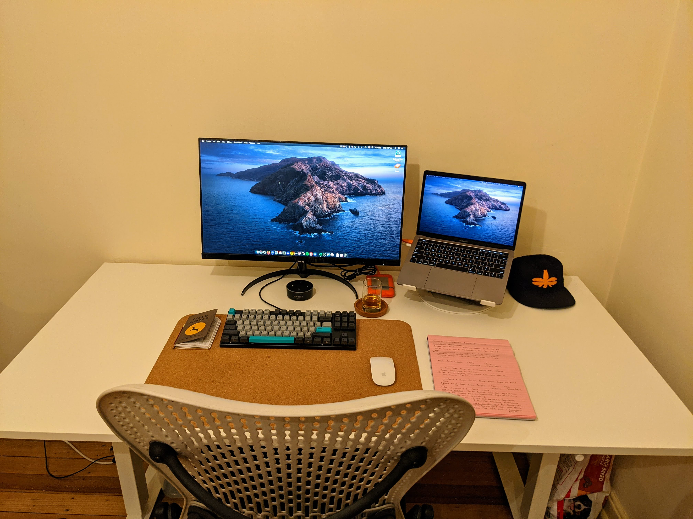

# workstation-setup

## Hardware

* Computer - MacBook Pro 13-inch, 2019
* Monitor - [Phillips 271E9/75](https://www.philips.com.au/c-p/271E9_75/lcd-monitor)
* Laptop Stand - [TwelveSouth Curve SE](https://www.twelvesouth.com/products/curve-for-macbook)
* Mouse - [Magic Mouse](https://en.wikipedia.org/wiki/Magic_Mouse)
* Keyboard - [Varmilo VA87M](https://mechanicalkeyboards.com/shop/index.php?l=product_detail&p=4911)
* Dongle - [USB-C Digital AV Multiport Adapter](https://www.apple.com/shop/product/MUF82/usb-c-digital-av-multiport-adapter)
* Headphones - [QuietComfort 35 wireless headphones II](https://www.bose.com.au/en_au/products/headphones/over_ear_headphones/quietcomfort-35-wireless-ii.html#v=qc35_ii_black)
* External HDD - [LaCie Rugged 1TB USB-C Portable Hard Drive](https://www.lacie.com/as/en/products/rugged/)

## Software

### Work Software

* SAP GUI
* IDE - [Eclipse](https://www.eclipse.org/)
* Email - Mac Mail

### Personal Software

* Text Editor / Lightweight IDE - [Atom](https://atom.io/)
* Email - [HEY](https://hey.com/)
* Terminal - [iTerm2](https://www.iterm2.com/)

## Furniture

* Chair - [Herman Miller Mirra v1](https://en.wikipedia.org/wiki/Mirra_chair)
* Sit/Stand Desk - [SKARSTA](https://www.ikea.com/au/en/p/skarsta-desk-sit-stand-white-s69324813/)
* Desk Mat - [SUSIG](https://www.ikea.com/au/en/p/susig-desk-pad-cork-30457663/)
